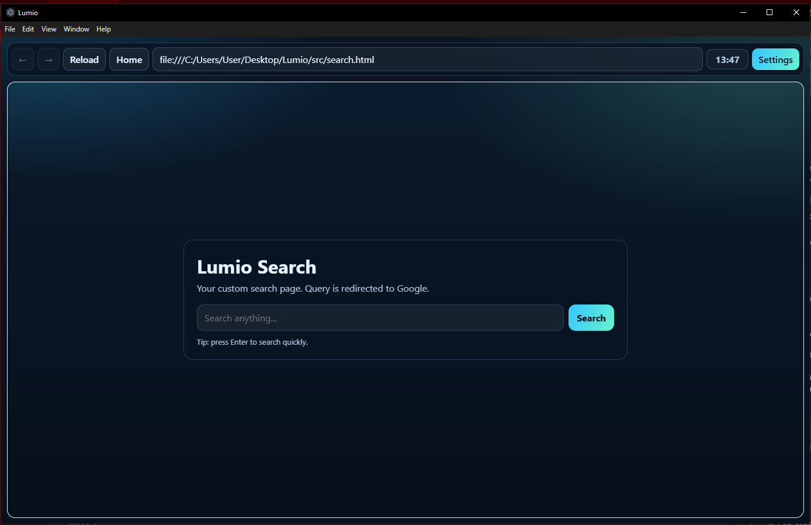

# Lumio Browser

Lumio is an experimental web browser built with **Electron** and **JavaScript**.  
The project is currently in early development, which means there are no source files or project structure in the repository yet.

## 🚧 Project Status

- 🔧 **Active development**
- 📂 **No source files yet**
- 🧪 **Preparing architecture and development environment**

## 🛠 Technologies

- **Electron** — cross-platform framework for building desktop apps using web technologies  
- **JavaScript** — main language for app logic and UI  
- *(More technologies will be added as the project grows)*

## 📌 Project Goals

- Build a lightweight, modern, customizable web browser  
- Explore the capabilities of Electron for browser-like applications  
- Create a modular and flexible UI

## 📅 Roadmap

- [x] Project initialization  
- [x] Core rendering structure  
- [x] UI prototype  
- [x] Settings & extensibility  
- [ ] Tab system  

## 🖼 Screenshot (early concept)

*(Replace `screenshot.png` with your actual file once added to the repository)*

## 🤝 Contributing

The project is currently in its preparation phase, but suggestions are welcome.  
Feel free to open an issue or start a discussion!
